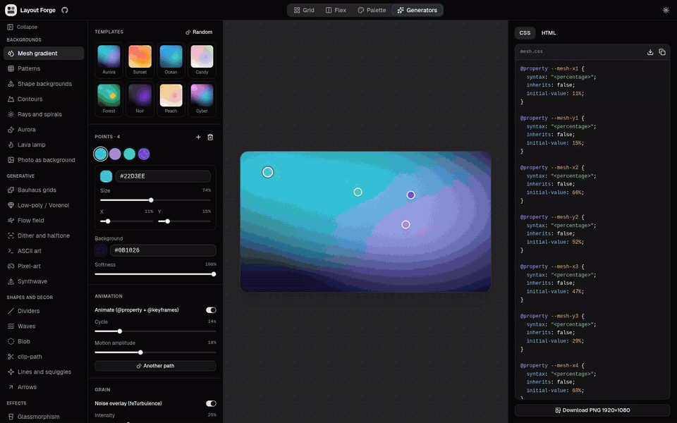
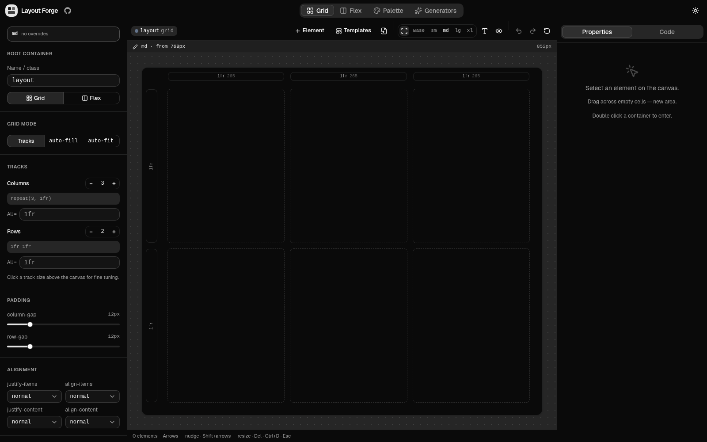
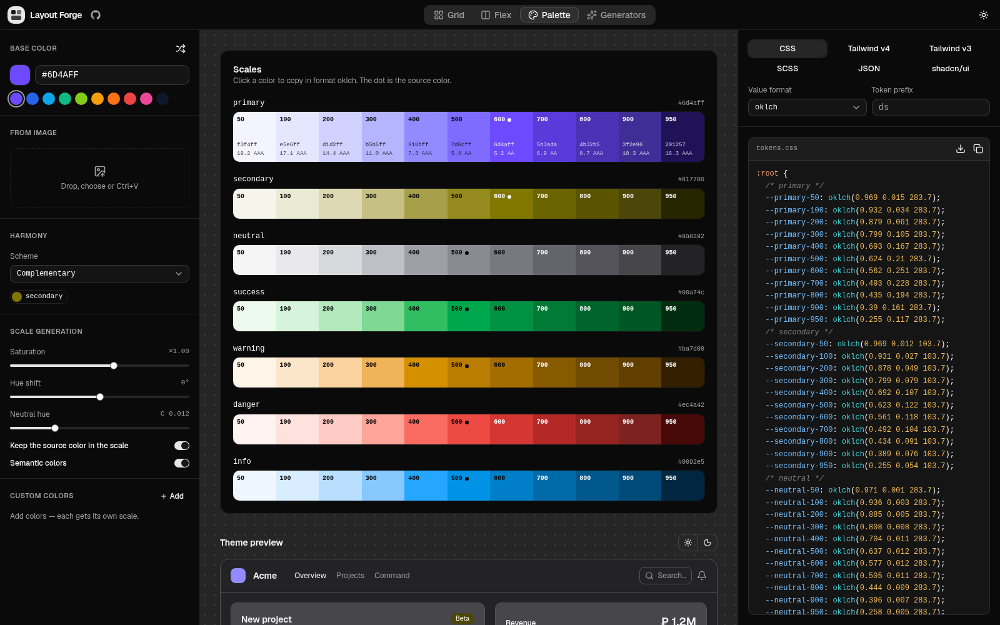

<div align="center">


# Layout Forge

**Visual generators for design and front-end work — in your browser, no account, no server.**

[](https://github.com/vumox/layout-forge/actions/workflows/ci.yml)
[](LICENSE)
[](CONTRIBUTING.md)


[Demo](https://vumox.github.io/layout-forge/) · [Features](#features) · [Quick start](#quick-start) · [Contributing](#contributing)

</div>

<p align="center"></p>

<p align="center">
  
  
</p>

## Features

| | |
|---|---|
| **Layout** | Drag & drop Grid, grid-area, subgrids, auto-fill / auto-fit, Flex, breakpoints, CSS import, export to CSS / Tailwind / JSX |
| **Color** | Palettes from a single color, CSS tokens, palette from an image |
| **Decor** | clip-path, blob, waves, patterns, shadows, glassmorphism, dividers, arrows, sunburst, SVG lines, CSS mask |
| **Generative graphics** | Animated mesh gradients, aurora, lava, low-poly and Voronoi, flow field, contour lines, Bauhaus, dither, ASCII, pixel art |
| **Animation and 3D** | CSS animations and effects, particles, three.js scenes, scroll video |
| **Extras** | Unit converter, device mockup editor, OG images, favicon generator |

Everything runs locally: your files and images never leave the browser.

## Tools

Open any tool directly in the [live demo](https://vumox.github.io/layout-forge/):

| Group | Tools |
|---|---|
| **Layout** | [Grid](https://vumox.github.io/layout-forge/#grid) · [Flex](https://vumox.github.io/layout-forge/#flex) · [Palette](https://vumox.github.io/layout-forge/#palette) |
| **Backgrounds** | [Mesh gradient](https://vumox.github.io/layout-forge/#tools/mesh) · [Patterns](https://vumox.github.io/layout-forge/#tools/pattern) · [Shape backgrounds](https://vumox.github.io/layout-forge/#tools/scatter) · [Contours](https://vumox.github.io/layout-forge/#tools/topo) · [Rays and spirals](https://vumox.github.io/layout-forge/#tools/burst) · [Aurora](https://vumox.github.io/layout-forge/#tools/aurora) · [Lava lamp](https://vumox.github.io/layout-forge/#tools/lava) · [Photo as background](https://vumox.github.io/layout-forge/#tools/image) |
| **Generative** | [Bauhaus grids](https://vumox.github.io/layout-forge/#tools/bauhaus) · [Low-poly / Voronoi](https://vumox.github.io/layout-forge/#tools/lowpoly) · [Flow field](https://vumox.github.io/layout-forge/#tools/flow) · [Dither and halftone](https://vumox.github.io/layout-forge/#tools/dither) · [ASCII art](https://vumox.github.io/layout-forge/#tools/ascii) · [Pixel-art](https://vumox.github.io/layout-forge/#tools/pixel) · [Synthwave](https://vumox.github.io/layout-forge/#tools/synth) |
| **Shapes and decor** | [Dividers](https://vumox.github.io/layout-forge/#tools/divider) · [Waves](https://vumox.github.io/layout-forge/#tools/wave) · [Blob](https://vumox.github.io/layout-forge/#tools/blob) · [clip-path](https://vumox.github.io/layout-forge/#tools/clip) · [Lines and squiggles](https://vumox.github.io/layout-forge/#tools/line) · [Arrows](https://vumox.github.io/layout-forge/#tools/arrow) |
| **Effects** | [Glassmorphism](https://vumox.github.io/layout-forge/#tools/glass) · [CSS mask](https://vumox.github.io/layout-forge/#tools/mask) · [CSS effects](https://vumox.github.io/layout-forge/#tools/fx) · [Shadows](https://vumox.github.io/layout-forge/#tools/shadow) |
| **3D and motion** | [3D scenes](https://vumox.github.io/layout-forge/#tools/three) · [CSS animations](https://vumox.github.io/layout-forge/#tools/animation) · [Particles](https://vumox.github.io/layout-forge/#tools/particles) · [Scroll video](https://vumox.github.io/layout-forge/#tools/scroll) |
| **Media and assets** | [Mockups](https://vumox.github.io/layout-forge/#tools/mockup) · [OG images](https://vumox.github.io/layout-forge/#tools/og) · [Favicon](https://vumox.github.io/layout-forge/#tools/favicon) |
| **Typography** | [Font units](https://vumox.github.io/layout-forge/#tools/units) |

## Quick start

```bash
git clone https://github.com/vumox/layout-forge.git
cd layout-forge
npm install
npm run dev
```

Build with `npm run build` — the output in `dist/` is static and works on any host. Checks: `npm run typecheck`, `npm run lint`, `npm test`.

## Tech stack

React 19 · TypeScript · Vite · Tailwind CSS v4 · shadcn/ui (Base UI) · three.js

## Contributing

Ideas, bug reports and PRs are welcome — see [CONTRIBUTING.md](CONTRIBUTING.md). To report a vulnerability, see [SECURITY.md](SECURITY.md).

## License

[MIT](LICENSE) © vumox
